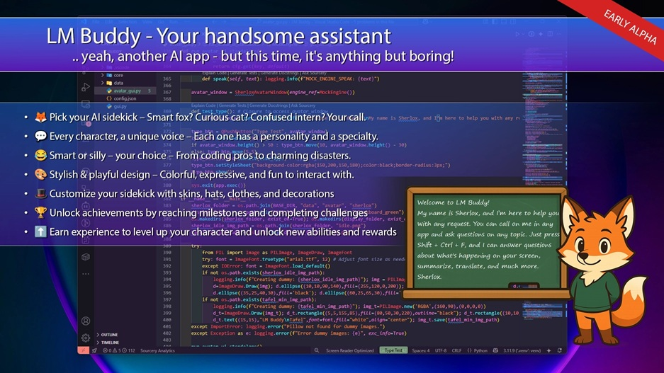

# 🦉 LM Buddy - Your Smart Desktop Companion ✨

 <!-- Optional: Create CONTRIBUTING.md later -->

**LM Buddy** aims to be an intelligent, interactive desktop assistant, inspired by the helpfulness of classic assistants (Clippy!) but supercharged with local or cloud-based LLMs. Meet **Sherlox** 🦊, your primary avatar, ready to analyze your screen, answer your questions, and guide you through your tasks!

This project is a personal journey of learning and exploration into AI, various programming languages, GUIs, and system interaction, driven by curiosity. I'm building this step-by-step and **welcome collaborators and contributors** who are also excited about this kind of technology! Let's learn and build together! 🚀

## 🌟 Core Features (current)

*   **🖥️ Screen Analysis:** LM Buddy (via Classic GUI) can take a screenshot of your active window.
*   **🔍 OCR Integration:** Extracts text from the captured screenshot using Tesseract OCR.
*   **🧠 LLM Interaction:**
    *   Sends the captured screen content (text and optionally image) or direct questions to an LLM.
    *   Supports custom LLM endpoints (e.g., local Ollama, LM Studio via OpenAI-compatible API).
    *   Streaming responses for a more interactive experience. (buggy at the moment)
    *   Context history is maintained for coherent conversations. (needs better saving system)
*   **🗣️ Text-to-Speech (TTS):** LM Buddy can read out LLM responses using `pyttsx3`.
*   **⌨️ Global Hotkey Activation:** Trigger screen analysis with a configurable global hotkey (default: `Ctrl+Shift+F`).
*   **🖼️ Classic UI (Tkinter):**
    *   A Tkinter-based window (`gui.py`) to display conversations, OCR results, and interaction options.
    *   Shows token counts (prompt, completion) for LLM requests (client-side estimation)/(testet and developed for huggingface only).
    *   Configurable settings via a menu (hotkey, system prompt, temperature, OCR language).
*   **🦊 Desktop Avatar UI (PySide6 - Work in Progress):**
    *   A frameless, always-on-top window (`avatar_ui.py`) displaying the your favorite avatar.
    *   Avatar can be dragged around the screen.
    *   Automatic direction switching (facing left/right) based on screen position.
    *   Context menu for basic interactions (e.g., closing, switching direction).
    *   Layered component system for avatar body and display element (e.g., blackboard).
    *   Text display on the avatar's "blackboard" with a typewriter effect.
*   **⚙️ Configuration:** Settings are saved in a `config.json` file.
*   **🧩 Modular Core Engine:** A significant portion of the core logic (config, OCR, TTS, LLM handling, hotkey management) has been refactored into an `LMBuddyCoreEngine` located in the `core` package. This promotes maintainability and supports multiple UI skins.

## 🛠️ Technologies & Libraries Used

*   **🐍 Python 3.11+**
*   **GUI Frameworks:**
    *   **Tkinter:** For the classic settings/conversation window.
    *   **PySide6 (Qt for Python):** For the Desktop Avatar UI.
*   **LLM Interaction:**
    *   `requests`: For HTTP API calls to LLM endpoints.
    *   `transformers` (Hugging Face): For client-side tokenization.
*   **Screen Interaction & OCR:**
    *   `Pillow (PIL)`: For image manipulation and screenshots.
    *   `pytesseract`: Python wrapper for Google's Tesseract OCR Engine.
    *   `pygetwindow`: To get active window information.
*   **Input/Output:**
    *   `pyttsx3`: For cross-platform Text-to-Speech.
    *   `keyboard`: For global hotkey listening.
    *   `pyperclip`: For clipboard operations.
*   **UI Enhancements (Tkinter specific):**
    *   `tkhtmlview`: To render HTML/Markdown in the Tkinter GUI.
    *   `markdown2`: For Markdown to HTML conversion.
*   **Development & Packaging (Planned/Potential):**
    *   `PyInstaller` / `cx_Freeze` / `Nuitka`: For creating distributable executables.

## 🚀 Roadmap & Future Ideas (What's Next!)

This project is actively evolving! Here's a glimpse of what's planned or being explored:

*   **🦊 Sherlox Avatar Enhancements:**
    *   **[In Progress]** "Show More" functionality for long texts on the avatar's display, adapting to screen resolution and potentially using a scrollable area.
    *   Visual avatar state changes (idle, thinking, typing, listening) with corresponding image assets.
    *   Interactive elements on/around the avatar (e.g., STT button, token display, quick action buttons).
    *   Customizable avatar skins (cat, dog, etc.) and accessories (hats, glasses) - potentially unlockable or selectable.
    *   Different display elements (e.g., computer monitor, futuristic panel).
*   **🗣️ Speech-to-Text (STT) Integration:** Allow users to dictate questions and commands.
*   **💡 Enhanced Screen Analysis:**
    *   **[Planned]** Screenshot a specific region selected by the user.
    *   Analyze currently selected text system-wide and offer contextual actions (translate, summarize, explain code).
*   **🌐 Expanded LLM Provider Support:**
    *   Easy configuration for OpenAI, Google Vertex AI, Anthropic, and other major providers.
    *   Handling for different API key / authentication mechanisms.
    *   Adapting request payloads for provider-specific formats if necessary.
*   **🎨 UI/UX Improvements:**
    *   Option to switch between the classic window UI and the Desktop Avatar UI seamlessly.
    *   Refine the look and feel of both UIs.
    *   Consider a Web App interface for broader accessibility (desktop-specific features would require a helper app).
*   **⚙️ Core Engine & Stability:**
    *   Further decouple UI from the core engine, potentially using a more formal event bus or message passing system for UI updates.
    *   Robust error handling and logging across all modules.
    *   Performance optimizations.
*   **🌍 Internationalization (i18n):** Make the application translatable into multiple languages.
*   **🔧 Advanced Configuration:**
    *   More granular control over avatar appearance and behavior via GUI.
    *   GUI for all settings, including hotkey customization for various actions.
*   **📚 Proactive Assistance & Learning:**
    *   LM Buddy could offer proactive tips or follow up on previous topics.
    *   "Gamification" elements like unlocking accessories through usage.

## 🤝 Contributing

Contributions, ideas, and feedback are highly welcome! This is a learning project, and collaboration can make it even better. Whether you're a seasoned developer or just starting, there are many ways to get involved:

*   Fork the repository.
*   Create a new branch for your feature or bug fix (`git checkout -b feature/YourFeature` or `git checkout -b fix/YourBug`).
*   Commit your changes (`git commit -m 'Add some feature'`).
*   Push to the branch (`git push origin feature/YourFeature`).
*   Open a Pull Request.
*   Open an issue to report bugs, suggest features, or ask questions.

(A `CONTRIBUTING.md` file with more detailed guidelines will be added as the project matures.)

Let's make LM Buddy an awesome and helpful companion together! 🎉

## 📝 License

This project is licensed under the Apache License 2.0 - see the [LICENSE](LICENSE) file for details.

---

*This README is a living document and will be updated as the project progresses.*